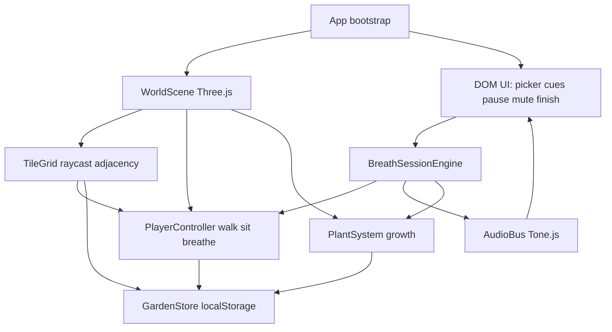
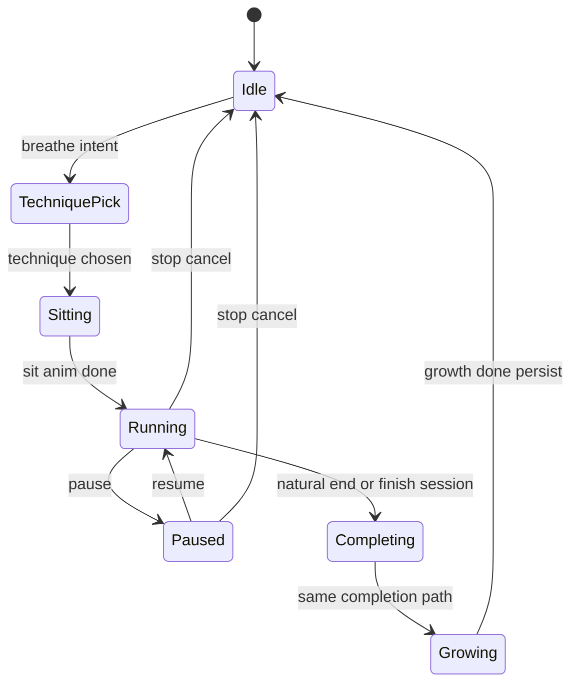

# feat: Breathwork Garden isometric grow loop

## Summary

Build a greenfield Vite + TypeScript + Three.js + Tone.js browser game: an isometric desert tile world where the player walks a low-poly character, sits for real guided breathwork (Wim Hof, coherence, energizing), and grows technique-specific plants that persist in localStorage. Opening the app shows a playable desert diorama with audio unlocked on first gesture.

## Problem Frame

The deliverable is a calm, Minecraft-adjacent breathwork toy — not a timer wrapped in 3D. Phase timing must be technique-accurate and drift-free; growth and greening must feel earned; audio must be fully synthesized. The repo is empty, so scaffolding, world, pacer, growth, audio, and persistence are all in scope for one coherent project.

## Requirements

### World and loop

- R1. Isometric (orthographic) camera over a small procedural tile grid; desert start with one center green tile and the player on it.
- R2. Click an adjacent tile to walk there with a real walk animation (no teleport).
- R3. On a tile, start a breathwork session: character sits cross-legged; on completion a plant grows (sprout → stem → bloom/canopy) and the tile turns green.
- R4. All geometry is procedural (no imported models/textures); flat-shaded, warm desert → green palette; soft shadows and gentle idle motion (dust, sway).

### Breathwork

- R5. Before a session, the player chooses among Wim Hof, coherence breathing, and energizing breath — each implemented faithfully (not a generic countdown).
- R6. Wim Hof: rounds of ~30 power breaths (active inhale, relaxed exhale), empty-lung retention as a count-up stopwatch ended by tap, then ~15s full-lung recovery hold; multiple rounds.
- R7. Coherence: continuous ~5.5s in / 5.5s out, no holds, multi-minute session.
- R8. Energizing: fast exhale-accented cycles (~1–2 breaths/sec) in short bursts with rests between.
- R9. One monotonic session clock drives phases (no drift); on-screen cues, phase countdown, round/cycle progress; pause and stop work; scene visuals (chest/aura/light) swell with inhale and settle with exhale.
- R10. A clearly labeled **finish session** dev button completes the current session via the same completion path as a natural finish.

### Audio, persistence, build

- R11. Tone.js only for breath cues, SFX, and generative ambient music; no audio files; unlock on first user gesture; mute toggle.
- R12. Grown plants and green tiles persist across reloads via localStorage.
- R13. Different techniques produce visibly different plant types with growth stages.
- R14. Project runs with `npm install && npm run dev` and builds with `npm run build`; targets smooth ~60fps.

## Assumptions

- Vanilla Three.js (not React Three Fiber) — simpler game-loop ownership for a single-canvas experience.
- Grid size ~9×9 (odd, center spawn) — small enough to read as a diorama, large enough to green over multiple sessions.
- Default session lengths: Wim Hof 3 rounds × 30 breaths; coherence ~5 minutes; energizing 4 bursts of ~20 cycles with short rests — tunable constants, not user-editable in v1.
- Clicking the character’s current tile (or a dedicated “Breathe here” control) opens technique picker; adjacent empty/sand/green tiles are walk targets.
- Re-breathing an already-green tile still runs a session and may upgrade/replace the plant for that technique (keeps the loop playable after the desert is full).
- Input is gated by session state: tile clicks and breathe-intent are ignored while `TechniquePick`, `Sitting`, `Running`, `Paused`, or `Growing`; only HUD controls (technique choice, pause/resume/stop, finish, retention tap, mute) are live. A second session cannot start until `Growing` completes and state returns to `Idle`.
- Keyboard: no movement keys in v1; Escape cancels `TechniquePick` back to `Idle` without sitting. Diagonal (Manhattan ≠ 1) clicks never walk.
- Safety: brief on-screen note for Wim Hof (practice seated, stop if dizzy); no medical claims.

## Scope Boundaries

### In scope

- Full playable grow-the-garden loop with three accurate pacers, procedural world, Tone.js audio, persistence, finish-session dev control.

### Out of scope

- Imported assets, free-orbit perspective camera, multiplayer, accounts, mobile-native apps, cold-exposure content.

### Deferred to Follow-Up Work

- Day/night sky response, critters, post-session Wim Hof retention stats UI, rich stats dashboard (bonus only if time remains after core loop).

## Key Technical Decisions

- **KTD1. Vanilla Three.js + Vite + TypeScript:** Avoids React reconciliation over a continuous render loop; one `requestAnimationFrame` owns animation, input, and session visuals.
- **KTD2. Orthographic isometric camera:** Equal XYZ offset + `lookAt` origin (classic Three.js isometric); zoom via frustum size; optional subtle pan/lerp toward character during sessions — never free orbit.
- **KTD3. Session clock = `performance.now()` timeline:** Phase boundaries computed from absolute start + accumulated pause offsets so phases cannot drift; Tone.js schedules audio from the same phase events (not the reverse).
- **KTD4. Breath engine as pure state machine:** Techniques are data + phase generators (`inhale|exhale|holdEmpty|holdFull|rest|retentionUser`); UI and 3D subscribe to phase snapshots — keeps Wim Hof user-ended retention and pause/stop testable without the renderer.
- **KTD5. Raycast tile picking:** `Raycaster` against tile meshes/planes maps clicks to grid coords; adjacency check gates walk vs ignore.
- **KTD6. Plant factory by technique:** Flower (coherence), tree/shrub (Wim Hof), grass tufts (energizing) — shared growth-stage interface, distinct procedural meshes.
- **KTD7. Audio bootstrap:** Call `Tone.start()` on first pointer/key gesture; master mute via destination volume; breath tones use soft envelopes; footsteps/chime/UI ticks are short synth bursts. Session lifecycle calls `AudioBus.endSession()` on stop/finish/complete so Transport loops cannot orphan.
- **KTD8. Persistence schema:** Versioned JSON in localStorage (`tiles[]` with `{x,z,terrain,plantType,growthStage}`, `stats`, `playerPos`) loaded before first paint of the garden. Persist only on growth-complete and player settle after walk — never mid-lerp or mid-growth.

## High-Level Technical Design

### Component topology



### Session state machine



From `TechniquePick`: Escape/Cancel → `Idle` (no sit). Tile raycasts ignored in `TechniquePick` / `Sitting` / `Growing` / active session. `stop` from `Running`/`Paused` → `Idle` skips growth; natural end / `finishSession` always → `Completing` → `Growing` → `Idle`.

### Wim Hof round shape (directional)

```text
for round in 1..N:
  repeat 30:
    inhale (active, ~1.5–2s) → exhale (passive, ~1–1.5s)
  retention empty: count-up until user tap
  recovery: inhale deep → holdFull ~15s → exhale
```

## Output Structure

```text
.
├── index.html
├── package.json
├── tsconfig.json
├── vite.config.ts
├── src/
│   ├── main.ts
│   ├── style.css
│   ├── app/
│   │   └── GameApp.ts
│   ├── world/
│   │   ├── WorldScene.ts
│   │   ├── TileGrid.ts
│   │   ├── Player.ts
│   │   ├── decor.ts
│   │   └── plants/
│   │       ├── PlantFactory.ts
│   │       ├── FlowerPlant.ts
│   │       ├── TreePlant.ts
│   │       └── GrassPlant.ts
│   ├── breath/
│   │   ├── types.ts
│   │   ├── BreathEngine.ts
│   │   ├── techniques/
│   │   │   ├── wimHof.ts
│   │   │   ├── coherence.ts
│   │   │   └── energizing.ts
│   │   └── SessionClock.ts
│   ├── audio/
│   │   └── AudioBus.ts
│   ├── persist/
│   │   └── gardenStore.ts
│   └── ui/
│       └── hud.ts
└── src/breath/BreathEngine.test.ts
```

Implementer may adjust filenames; unit file lists below are authoritative for intent.

## Implementation Units

### U1. Scaffold Vite TypeScript Three Tone

- **Goal:** Runnable empty canvas app with deps, TS strictness, and `dev`/`build` scripts.
- **Requirements:** R14
- **Dependencies:** None
- **Files:**
  - Create: `package.json`, `tsconfig.json`, `vite.config.ts`, `index.html`, `src/main.ts`, `src/style.css`, `src/vite-env.d.ts`
- **Approach:** Vite vanilla-ts template shape; depend on `three`, `tone`; path alias optional; canvas fullscreen warm background.
- **Test scenarios:**
  - Happy path: `npm install` then `npm run build` exits 0 and emits `dist/`.
  - Happy path: `npm run dev` serves without compile errors.
- **Verification:** Fresh install builds; browser shows blank/warm canvas shell.

### U2. Isometric desert world and player

- **Goal:** Diorama reads instantly: sand grid, sparse cactus/rocks, center green tile, low-poly character with ground shadow.
- **Requirements:** R1, R4
- **Dependencies:** U1
- **Files:**
  - Create: `src/world/WorldScene.ts`, `src/world/TileGrid.ts`, `src/world/Player.ts`, `src/world/decor.ts`, `src/app/GameApp.ts`
  - Modify: `src/main.ts`, `src/style.css`
- **Approach:** OrthographicCamera equal offsets; flat `MeshLambertMaterial` / flat shading; directional + ambient lights with shadow map; procedural box/sphere/cone character; tile height slight variation; heat-dust particles as simple points or small quads.
- **Test scenarios:**
  - Happy path: on load, center tile is green and player stands on it; other tiles sand-colored.
  - Edge case: window resize updates orthographic frustum and renderer size without breaking framing.
- **Verification:** First paint matches desert diorama identity; no free-orbit controls.

### U3. Walk loop via adjacent tile clicks

- **Goal:** Click-to-walk with animated steps and footstep hooks.
- **Requirements:** R2
- **Dependencies:** U2
- **Files:**
  - Modify: `src/world/TileGrid.ts`, `src/world/Player.ts`, `src/app/GameApp.ts`
  - Create: `src/world/pathing.ts` (optional adjacency helper)
- **Approach:** Raycast → grid cell; if Manhattan distance 1 and player `Idle` (not walking and session state `Idle`), lerp/step across tile with bobbing walk cycle; ignore all tile picks during walk, `TechniquePick`, `Sitting`, `Running`/`Paused`, and `Growing`.
- **Test scenarios:**
  - Happy path: click orthogonal neighbor → player animates to that tile and ends centered.
  - Edge case: click non-adjacent or diagonal → no move.
  - Edge case: click during walk → ignored until idle.
  - Edge case: click any tile while technique picker is open, during sit animation, or during plant growth → no walk and no second session start.
- **Verification:** Movement never teleports; only ortho-adjacent tiles work.

### U4. Breath session engine (three techniques)

- **Goal:** Drift-free, technique-accurate pacer with pause/stop and user-ended Wim Hof retention.
- **Requirements:** R5–R9
- **Dependencies:** U1
- **Files:**
  - Create: `src/breath/types.ts`, `src/breath/SessionClock.ts`, `src/breath/BreathEngine.ts`, `src/breath/techniques/wimHof.ts`, `src/breath/techniques/coherence.ts`, `src/breath/techniques/energizing.ts`, `src/breath/BreathEngine.test.ts`
- **Approach:** `SessionClock` exposes `nowMs()` = monotonic − pause total; engine emits `{phase, label, phaseElapsed, phaseRemaining, round, cycle, breathFill01}`; Wim Hof retention phase has `remaining: null` and `awaitingUserEnd: true`; finish/stop APIs. `finishSession()` is valid in any non-idle phase including empty retention — skips remaining rounds and invokes the same `onComplete` as natural end (does not require `endRetention()` first).
- **Execution note:** Implement engine test-first for phase sequences and pause behavior.
- **Test scenarios:**
  - Happy path: coherence alternates inhale/exhale at 5500ms each with no hold phases.
  - Happy path: Wim Hof after 30 breaths enters empty retention; `endRetention()` advances to recovery hold ~15s.
  - Happy path: energizing produces fast cycles then rest intervals.
  - Edge case: pause mid-phase freezes remaining time; resume continues without skipping.
  - Edge case: stop from running returns to idle without completing.
  - Edge case: `finishSession()` during Wim Hof empty retention completes without calling `endRetention()`; recovery hold is skipped.
  - Integration: `finishSession()` triggers the same `onComplete` callback as natural end.
- **Verification:** Unit tests cover all three techniques’ phase shapes; no `setInterval` chain for phase timing.

### U5. Session UX, sit pose, and breath-synced scene

- **Goal:** Technique picker, cues, progress, pause/stop/finish-session; character sits and world paces breath visually.
- **Requirements:** R3, R9, R10
- **Dependencies:** U3, U4
- **Files:**
  - Create: `src/ui/hud.ts`
  - Modify: `src/world/Player.ts`, `src/world/WorldScene.ts`, `src/app/GameApp.ts`, `src/style.css`
- **Approach:** Minimal HUD over canvas; sit animation to cross-legged; scale chest/aura/emissive with `breathFill01`; camera eases slightly closer on session start; **Finish session** button always visible during Running/Paused and calls engine `finishSession()`.
- **Test scenarios:**
  - Happy path: start coherence → cues show “Breathe in”/“Breathe out” with countdown; aura tracks fill.
  - Happy path: Finish session during a session runs completion → growth path (wired in U6).
  - Edge case: pause hides countdown advance; stop returns to idle pose without growth.
  - Edge case: Wim Hof retention shows count-up and a tap target to end hold.
  - Edge case: with picker open, Escape/Cancel returns to idle standing without sit; tile clicks ignored until session ends and growth finishes.
  - Edge case: **Finish session** during Wim Hof retention count-up still runs completion → growth; retention tap is dismissed.
- **Verification:** Manual playthrough of one short session; finish button labeled clearly for evaluators.

### U6. Plant growth variety and tile greening

- **Goal:** Satisfying multi-stage growth; technique → plant type; tile turns green.
- **Requirements:** R3, R13
- **Dependencies:** U5
- **Files:**
  - Create: `src/world/plants/PlantFactory.ts`, `src/world/plants/FlowerPlant.ts`, `src/world/plants/TreePlant.ts`, `src/world/plants/GrassPlant.ts`
  - Modify: `src/world/TileGrid.ts`, `src/app/GameApp.ts`
- **Approach:** On session complete for tile `(x,z)`, set terrain green, spawn plant for technique, animate stages over ~1–2s; grown plants idle-sway in render loop.
- **Test scenarios:**
  - Happy path: completing Wim Hof vs coherence vs energizing yields three visually distinct plant meshes.
  - Happy path: growth passes through intermediate scales/meshes (not pop-in full).
  - Edge case: completing on already-green tile still plays growth (replace or restage) without crashing.
- **Verification:** Side-by-side three techniques show variety; greening is obvious from isometric view.

### U7. Tone.js audio bus

- **Goal:** Breath-synced cues, cute SFX, ambient loop, mute, autoplay-safe start.
- **Requirements:** R11
- **Dependencies:** U4, U5
- **Files:**
  - Create: `src/audio/AudioBus.ts`
  - Modify: `src/app/GameApp.ts`, `src/ui/hud.ts`
- **Approach:** Lazy init after `Tone.start()`; map phase transitions to envelope tones (rise inhale, fall exhale, soft hold cue); footstep on walk contacts; chime+noise sparkle on growth; low generative pad whose filter/brightness scales with `%` green tiles; mute toggles master gain. On `pause` suspend breath cue schedulers; on `resume` continue from current phase; on `stop`/`finishSession`/`onComplete` call `AudioBus.endSession()` to stop/dispose session-scoped Transport events so no orphan loops remain.
- **Test scenarios:**
  - Happy path: before first gesture, no thrown errors; after click, music/cues audible.
  - Happy path: mute silences all buses; unmute restores.
  - Edge case: phase tones use attack/release — no clicky square blips at default volumes.
  - Edge case: pause mid-inhale freezes breath tones until resume; after finish/complete, no further phase tones and no leftover session Transport loops.
- **Verification:** Listen pass: cues track pacer; SFX quiet and pleasant.

### U8. Persistence and garden restore

- **Goal:** Reload restores greens, plants, player position, and light stats.
- **Requirements:** R12
- **Dependencies:** U6, U7
- **Files:**
  - Create: `src/persist/gardenStore.ts`, `src/persist/gardenStore.test.ts`
  - Modify: `src/app/GameApp.ts`, `src/world/TileGrid.ts`, `src/ui/hud.ts`
- **Approach:** Load sync at boot before building meshes; persist only on growth animation complete (final stage + green terrain) and on player settle after walk (never mid-lerp or mid-growth); schema version field; optional stats line (sessions, tiles greened).
- **Test scenarios:**
  - Happy path: after greening two tiles, reload restores those greens/plants and player cell.
  - Edge case: corrupt/missing JSON falls back to default desert + center green without crash.
  - Edge case: unknown `schemaVersion` resets or migrates safely (document chosen behavior in code comment).
  - Edge case: reload during walk → restore last settled `playerPos` (start tile of incomplete walk), not mid-path.
  - Edge case: reload mid-growth → no partial plant checkpoint; tile stays pre-complete until a full session earns growth.
- **Verification:** Hard refresh mid-garden preserves progress.

## Acceptance Examples

- AE1. **First paint:** Given a cold load with empty storage, when the app opens, then the isometric desert appears with the character on the sole green center tile.
- AE2. **Walk then breathe:** Given the player is idle, when they click an adjacent sand tile and start coherence, then they walk, sit, see in/out cues at ~5.5s, and on completion a flower grows and the tile greens.
- AE3. **Wim Hof retention:** Given a Wim Hof round after power breaths, when retention starts, then a count-up is shown until the user taps to end, then a ~15s recovery hold runs.
- AE4. **Finish session parity:** Given any running session, when **Finish session** is pressed, then the same completion handler runs as natural end (plant + persist).
- AE4b. **Finish during retention:** Given Wim Hof empty-lung retention (count-up visible), when **Finish session** is pressed, then retention ends immediately, completion → growth → persist runs, and breath tones/Transport session loops stop.
- AE5. **Persistence:** Given three greened tiles, when the page reloads, then those tiles and plants remain.
- AE6. **Input lockout:** Given technique picker open or growth playing, when the user clicks a different tile, then the player does not walk and no second session starts.

## Risks & Dependencies

| Risk | Mitigation |
|------|------------|
| Browser autoplay blocks audio | Unlock only on gesture; UI works silent until then |
| Wim Hof safety / fainting risk | Seated pose + short safety copy; user-controlled retention end |
| Phase drift from chained timeouts | Absolute timeline via `SessionClock` |
| 60fps with many meshes | Small grid; shared materials; limit particle count |
| Tone.js API surface churn | Pin Tone major in package.json; use `Tone.start` + synths documented in current Tone docs |
| Orphan Tone.Transport loops after finish/stop | `AudioBus.endSession()` on every terminal transition; no global Transport loop without session scope |
| Persist mid-walk / mid-growth → corrupt garden | Save only on settle + growth-complete; boot loads last good snapshot |

## Sources & Research

- Three.js isometric: OrthographicCamera with equal position components + `lookAt` (community pattern; WestLangley SO guidance).
- Official Wim Hof breathing: ~30 deep breaths, empty retention until urge, 15s recovery hold, 3–4 rounds (wimhofmethod.com).
- Tone.js: must `Tone.start()` from user gesture; schedule with Transport/Draw time parameter for sync (tonejs.github.io).
- Repo research: empty greenfield — no local patterns; institutional `docs/solutions/` absent.
